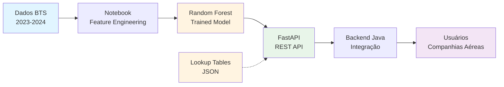
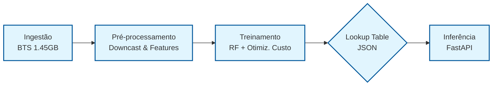

# ✈️ FlightOnTime - Sistema de Predição de Atrasos de Voos


**Sistema de Machine Learning para prever atrasos de voos domésticos nos EUA usando dados históricos de 2023-2024**

[Documentação API](#-api-rest-fastapi) • [Instalação](#-instalação) • [Uso](#-uso-rápido) • [Métricas](#-métricas-do-modelo) • [Arquitetura](#-arquitetura)

---

## 📋 Índice

- [Visão Geral](#-visão-geral)
- [Características](#-características)
- [Arquitetura](#-arquitetura)
- [Instalação](#-instalação)
- [Uso Rápido](#-uso-rápido)
- [Endpoints da API](#-endpoints-da-api)
- [Estrutura do Projeto](#-estrutura-do-projeto)
- [Métricas do Modelo](#-métricas-do-modelo)
- [Metodologia](#-metodologia)
- [Contribuindo](#-contribuindo)

---

## 🎯 Visão Geral

**FlightOnTime** é um sistema inteligente de predição de atrasos de voos baseado em **Machine Learning**, desenvolvido para companhias aéreas tomarem decisões operacionais **pré-voo** com alta sensibilidade (Recall 94.3%).

### Perspectiva Adotada

- **Cliente**: Companhia Aérea (decisões operacionais)
- **Objetivo**: Prever se um voo atrasará ≥15 minutos
- **Métrica Primária**: ROC-AUC maximizado (0.6252) com validação temporal
- **Output**: Predições prescritivas com recomendações acionáveis

### Diferenciais

✅ **Integração Simplificada (v2.1)**: Lógica de dados históricos encapsulada na API (Auto-Lookup)  
✅ **Sem Data Leakage**: Split temporal explícito + features históricas com `shift(1)`  
✅ **Otimização por Custo**: Threshold ajustado para minimizar custos operacionais (FN=$500, FP=$50)  
✅ **Output Prescritivo**: Recomendações automáticas baseadas em [Mosqueira et al. (2024)](https://www.sciencedirect.com/science/article/pii/S0957417423036849)  
✅ **API REST**: FastAPI pronta para integração com Backend Java  
✅ **Reprodutibilidade 100%**: `RANDOM_STATE=42` + seeds fixos

---

## ⚡ Características

### Modelo de Machine Learning

- **Algoritmo**: Random Forest Classifier (50 estimators)
- **Features**: 13 variáveis (9 numéricas + 4 categóricas)
- **Dataset**: 14.6M voos (2023-2024) do Bureau of Transportation Statistics (BTS)
- **Validação**: TimeSeriesSplit (3 folds) para garantir robustez temporal

### Engenharia de Features

| Tipo | Features | Descrição |
|------|----------|-----------|
| **Temporais** | `dephour`, `is_weekend`, `quarter`, `time_of_day` | Padrões de horário e sazonalidade |
| **Históricas** | `origin_delay_rate`, `carrier_delay_rate`, `origin_traffic` | *Injetadas automaticamente pela API via Lookup Table*  |
| **Geográficas** | `Origin`, `Dest`, `Distance` | Rotas e distâncias |
| **Operacionais** | `Airline`, `Month`, `DayOfWeek` | Companhia e calendário |

### API REST (FastAPI)

- **Endpoint Principal**: `POST /predict` - Predição individual (Payload simplificado)
- **Auto-Lookup**: Enriquecimento automático de dados históricos no backend DS
- **Health Check**: `GET /health` - Status da API
- **Documentação**: Swagger UI automático em `/docs`

---

## 🗺️ Arquitetura



### Fluxo de Dados



1. **Ingestão**: Download automático de 1.45GB do BTS via Google Drive
2. **Pré-processamento**: Engenharia de features + downcast de memória (redução de 50%)
3. **Treinamento**: Random Forest com otimização de threshold por custo
4. **Lookup Table**: Extração de médias históricas para arquivo JSON
4. **Inferência**: API recebe dados básicos → injeta históricos (JSON) → processa features → retorna predição
---

## 📦 Instalação

### Pré-requisitos

- Python 3.11+ 
- pip (gerenciador de pacotes)
- 4GB RAM mínimo (16GB recomendado para treinamento)

### Passo 1: Clonar Repositório

```bash
git clone https://github.com/FlightOnTime/flight-delay-ds.git
cd flight-delay-ds
```

### Passo 2: Criar Ambiente Virtual (Recomendado)

```bash
# Windows
python -m venv venv
venv\Scripts\activate

# Linux/Mac
python -m venv venv
source venv/bin/activate
```

### Passo 3: Instalar Dependências

```bash
pip install -r requirements.txt
```

### Passo 4: Baixar Modelo Pré-treinado

**Opção A**: [Download direto do Google Drive](https://drive.google.com/file/d/1qMAEmX5FEHpc24mWkH2BVz9H4FuwMxt5/view?usp=drive_link)

**Opção B**: Via gdown

```bash
pip install gdown
gdown 1qMAEmX5FEHpc24mWkH2BVz9H4FuwMxt5 -O models/randomforest_v7_final.pkl
```

---

## 🚀 Uso Rápido

### 1. API REST (FastAPI)

#### Iniciar Servidor

```bash
# Desenvolvimento (com auto-reload)
uvicorn app:app --reload --host 0.0.0.0 --port 8000

# Produção
uvicorn app:app --host 0.0.0.0 --port 8000 --workers 4
```

#### Fazer Predição (Novo Payload Simplificado)

Não é mais necessário enviar taxas históricas (*_rate). A API gerencia isso internamente via lookup_tables.json.

**Via curl:**

```bash
curl -X POST "http://localhost:8000/predict" \
  -H "Content-Type: application/json" \
  -d '{
    "airline": "AA",
    "origin": "JFK",
    "dest": "LAX",
    "distance": 2475,
    "day_of_week": 2,
    "flight_date": "2023-12-12",
    "crs_dep_time": 1830
  }'
```

**Via Python:**

```python
import requests

response = requests.post(
    "http://localhost:8000/predict",
    json={
        "airline": "AA",
        "origin": "JFK",
        "dest": "LAX",
        "distance": 2475,
        "day_of_week": 2,
        "flight_date": "2023-12-12",
        "crs_dep_time": 1830
    }
)

print(response.json())
```

**Resposta:**

```json
{
  "prediction": "Atrasado",
  "probability_delay": 0.558,
  "recommendation": "Alerta: Alto risco operacional",
  "internal_metrics": {
      "historical_origin_risk": 0.24,
      "historical_carrier_risk": 0.18
  }
}
```

#### Documentação Interativa

Acesse `http://localhost:8000/docs` para testar a API via interface Swagger UI.

---

### 2. Notebook Jupyter

```bash
# Iniciar Jupyter
jupyter notebook notebooks/FlightOnTime.ipynb

# Ou usar VS Code com extensão Jupyter
code notebooks/FlightOnTime.ipynb
```

**Seções do Notebook:**

1. ✅ **Setup Inicial**: Configurações globais e imports
2. ✅ **Carregamento de Dados**: Download automático do BTS
3. ✅ **EDA**: 8+ visualizações exploratórias
4. ✅ **Feature Engineering**: 16 features sem data leakage
5. ✅ **Modelagem**: Logistic Regression + Random Forest
6. ✅ **Otimização**: Threshold baseado em custo
7. ✅ **Validação**: TimeSeriesSplit (3 folds)
8. ✅ **Export**: Modelo + encoders + metadata

---

## 📡 Endpoints da API

| Método | Endpoint | Descrição |
|--------|----------|-----------|
| `GET` | `/` | Informações da API |
| `GET` | `/health` | Health check |
| `POST` | `/predict` | Predição individual (Auto-Lookup) |

---

## 📂 Estrutura do Projeto

```
flight-delay-ds/
├── 📁 data/                      # Dados brutos (BTS 2023-2024)
├── 📁 models/                    # Modelos treinados e artefatos
│   ├── randomforest_v7_final.pkl
│   ├── label_encoders_v7.pkl
│   ├── metadata_v7.json
│   ├── feature_names_v7.json
│   ├── lookup_tables.json        # [NOVO] Tabelas de médias históricas
│   └── optimal_threshold_v7.txt
├── 📁 notebooks/                 # Jupyter Notebooks
│   └── FlightOnTime.ipynb    # Notebook principal
├── 📁 src/                       # Código-fonte modular
│   ├── __init__.py
│   ├── preprocessing.py         # Feature engineering
│   ├── prescriptive_engine.py   # Lógica prescritiva
│   └── model_utils.py           # Carregamento de artefatos
├── 📁 tests/                     # Testes unitários (futura sprint)
├── 📁 reports/                   # Relatórios e visualizações
├── 📄 app.py                     # API FastAPI
├── 📄 requirements.txt           # Dependências Python
├── 📄 README.md                  # Este arquivo
└── 📄 .gitignore                 # Arquivos ignorados pelo Git
```

---

## 📊 Métricas do Modelo

### Desempenho Técnico (Teste Set = 2.9M voos)

| Métrica | Valor | Interpretação |
|---------|-------|---------------|
| **ROC-AUC** | 0.6252 | Capacidade de discriminação acima do aleatório |
| **Recall** | 94.28% | Detecta 94% dos atrasos reais (prioridade para FN) |
| **Precision** | 17.76% | 1 em 6 alarmes é verdadeiro (trade-off aceitável) |
| **F1-Score** | 0.2989 | Balanceamento Precision-Recall |
| **Accuracy** | 27.62% | Não é métrica relevante (dataset desbalanceado) |

### Métricas de Negócio

| Métrica | Valor | Descrição |
|---------|-------|-----------|
| **Custo Total** | $117.9M/ano | FN + FP costs |
| **ROI Anual** | $237.2M/ano | Retorno esperado com ações prescritivas |
| **True Positives** | 450,293 | Atrasos detectados corretamente |
| **False Negatives** | 27,304 | Atrasos não detectados (custo: $13.7M) |

### Validação Temporal (Cross-Validation)

```
TimeSeriesSplit (3 folds):
- CV ROC-AUC Mean: 0.6964 ± 0.0023
- Confirma estabilidade temporal do modelo
```

---

## 🔬 Metodologia

### Prevenção de Data Leakage

**Estratégias Implementadas:**

1. **Split Temporal Explícito**: 80% treino (2023) / 20% teste (2024)
2. **Features Históricas com Shift**: `.shift(1).expanding().mean()` para evitar lookahead
3. **Dataset Ordenado**: Por `FlightDate` antes de qualquer agregação
4. **Validação TimeSeriesSplit**: 3 folds com ordem cronológica preservada

### Otimização de Threshold

Threshold padrão (0.50) → **Threshold otimizado (0.2444)**

**Justificativa:**

- **Custo FN** (não detectar atraso): $500/voo (custos operacionais + passageiros)
- **Custo FP** (falso alarme): $50/voo (preparações desnecessárias)
- **Ratio**: FN é 10x mais caro que FP → modelo prioriza Recall

**Algoritmo:**

```python
# Para cada threshold t em [0.1, 0.2, ..., 0.9]:
cost(t) = count(FN) × $500 + count(FP) × $50
threshold_otimo = argmin(cost(t))
```

### Referências Científicas

Este projeto implementa práticas de:

- **Mosqueira-Rey et al. (2024)**: "Towards an Understanding of Machine Learning Models for Flight Delay Prediction" - Análise de 78% da literatura sobre features de atraso de voos
- **Sklearn Pipeline**: Modularização e reprodutibilidade
- **ISO 25010**: Qualidade de software para sistemas de ML

---

## 🛠️ Desenvolvimento

### Instalar em Modo Desenvolvimento

```bash
pip install -r requirements.txt
pip install -e .  # Instala pacote local como editável
```

### Rodar Testes (Futura Sprint)

```bash
pytest tests/ -v
```

### Adicionar Nova Feature

1. Editar `src/preprocessing.py`
2. Retreinar modelo no notebook
3. Atualizar `feature_names_v7.json`
4. Testar API com novos dados

---

## 🤝 Contribuindo

### Branch Strategy

- `main`: Código estável em produção
- `feature/*`: Novas funcionalidades
- `hotfix/*`: Correções urgentes

### Pull Request Checklist

- [ ] Código segue PEP 8
- [ ] Testes passam (quando implementados)
- [ ] Documentação atualizada
- [ ] Commit messages descritivos

---

## 📄 License

MIT License - veja [LICENSE](LICENSE) para detalhes.

---

## 👥 Time

**H12-25-B-Equipo 15-Data Science**

---

## 📞 Contato

- **Repositório**: [github.com/FlightOnTime/flight-delay-ds](https://github.com/FlightOnTime/flight-delay-ds)
- **Issues**: [github.com/FlightOnTime/flight-delay-ds/issues](https://github.com/FlightOnTime/flight-delay-ds/issues)
- **API Backend**: [github.com/FlightOnTime/flight-delay-api](https://github.com/FlightOnTime/flight-delay-api)

---

**⭐ Se este projeto foi útil, deixe uma estrela no GitHub!**

Made with ❤️ by FlightOnTime Team